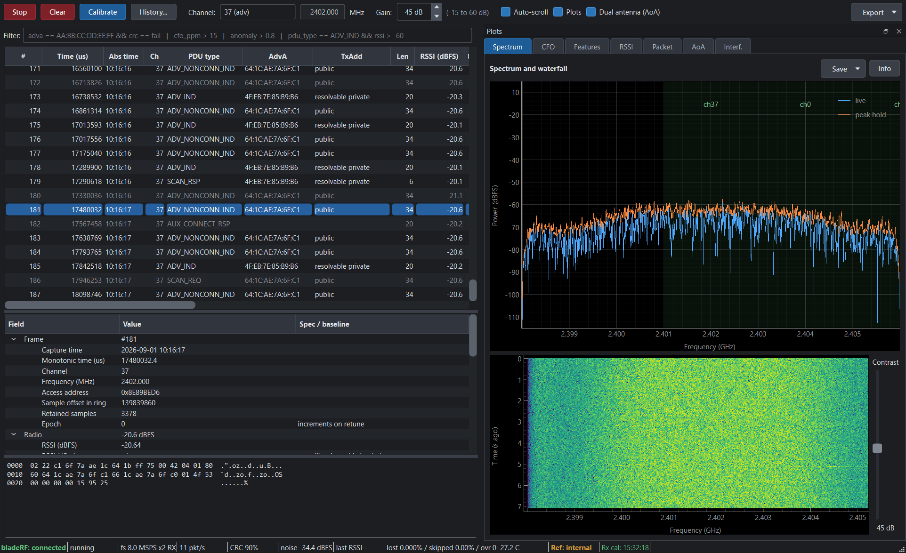

# BLE Single-Channel Sniffer with Live RF-Fingerprint GUI

A single-channel Bluetooth Low Energy advertising sniffer for the **Nuand
bladeRF 2.0 micro**. It tunes to one BLE channel, decodes advertising PDUs in
real time, extracts physical-layer features from every packet, and shows them in
a Wireshark-style GUI: scrolling packet list, per-packet detail tree, hex dump,
plus live spectrum, feature, and angle-of-arrival plots.



The purpose is **defensive**: identify transmitters that share an advertised
address but not a radio (address-spoofing / beacon cloning), and characterise
interference on the selected channel. **Receive only** — no transmit path exists
in the software.

---

## 1. Hardware requirements

| Item | Requirement | Link |
|---|---|---|
| **SDR** | Nuand bladeRF 2.0 micro (xA4 or xA9). Verified on **xA4**, FPGA 0.14.0, firmware 2.4.0, libbladeRF 2.4.1 | <https://www.nuand.com/bladerf-2-0-micro/> |
| **USB** | USB 3.0 SuperSpeed port (required to sustain 8 MSPS; USB 2.0 will drop samples) | — |
| **Antenna** | One 2.4 GHz antenna on **RX1** (SMA). A second on **RX2** enables angle-of-arrival | e.g. <https://www.nuand.com/product/2-4ghz-antenna/> |
| **Host** | A mid-range laptop/desktop. A hybrid Intel CPU (P+E cores) is handled automatically by pinning the capture and DSP stages to performance cores. Verified on an i7-1255U | — |
| **Optional: 10 MHz reference** | A disciplined GPSDO into the **U.FL clock input** makes carrier-offset features absolute rather than session-relative | e.g. <https://www.leobodnar.com/shop/index.php?main_page=product_info&products_id=234> |
| **Optional: reference beacon** | A Nordic **nRF52840** (e.g. Adafruit Feather) to generate known test traffic for validation | <https://www.nordicsemi.com/Products/nRF52840> |

The bladeRF's own USB drivers and the `bladeRF.dll` / `libbladeRF.so` shared
library must be installed (the standard [bladeRF
installer](https://github.com/Nuand/bladeRF/wiki/Getting-Started%3A-Windows) on
Windows, or your distribution's `libbladerf` package on Linux). No Python
bladeRF binding is needed — the app binds the shared library directly with
`ctypes` (`sniffer/libbladerf.py`), so it works on current CPython without a
build step. Set `BLADERF_LIBRARY` if the library is not on the default path.

---

## 2. Python environment and running

Python **3.11+** (developed and tested on **3.14**). Install the dependencies:

```bash
pip install -r requirements.txt
#   numpy scipy PyQt6 pyqtgraph pyarrow numba pytest
```

### Run the GUI

```bash
python main.py                       # channel 37 (2402 MHz), default
python main.py --channel 38          # 2426 MHz
python main.py --freq 2426e6         # direct LO override
python main.py --gain 45             # manual RX gain, dB
python main.py --enroll AA:BB:CC:DD:EE:FF   # collect a baseline for one device
python main.py --external-clock      # discipline to a 10 MHz U.FL reference
```

Data channels require the access address (and, for a live connection, the CRC
init) explicitly, because the advertising defaults will not decode them:

```bash
python main.py --channel 5 --access-address 0x9E8B4B27 --crc-init 0x555555
```

### Headless capture (no GUI) — writes CSV / Parquet / PCAP / JSON

```bash
python main.py --headless --seconds 60 --channel 37 --out capture
```

The PCAP uses `LINKTYPE_BLUETOOTH_LE_LL_WITH_PHDR`, so it opens in Wireshark
next to this tool.

### Angle of arrival (two antennas)

```bash
python main.py --dual-antenna        # RX2 as a second coherent antenna
```

Both RX channels share one LO, so this is a **spatial** measurement at one
frequency — it does not watch two BLE channels at once. Calibrate the array's
fixed phase offset from a known source (the **Calibrate** button) before reading
bearings.

### Self-test (no radio needed)

```bash
python main.py --self-test           # or: python -m pytest -q
```

The suite (200+ tests) validates every estimator against a synthetic GFSK
generator with known injected impairments, plus the DSP, analysis, export, and
GUI logic — none of it needs the hardware.

### Offline three-channel join

```bash
python main.py --join s37.parquet s38.parquet s39.parquet
```

Reconstructs cross-channel RSSI ratios from three sequential single-channel
sessions (with an explicit non-simultaneity warning).

---

## 3. How it works (calculation)

Everything is vectorised: Python only ever touches whole arrays or short
per-packet byte slices, never per-sample loops at 8 MSPS. The stages run in
three processes (capture / DSP / feature+analysis) decoupled by bounded queues
and a lock-free shared-memory IQ ring.

**Instantaneous frequency** of the GFSK signal, from the argument of the
conjugate product:

$$
 f[n] = \frac{f_s}{2\pi} \cdot \arg\big(x[n+1] \cdot x^*[n]\big)
$$

**Packet detection**: correlate the instantaneous frequency against the known
preamble + access-address template (FFT overlap-save), recover symbol timing,
de-whiten with the channel-seeded 7-bit LFSR ($$x^7 + x^4 + 1$$), and check the BLE
**CRC-24** ($$x^{24} + x^{10} + x^9 + x^6 + x^4 + x^3 + x + 1$$, init `0x555555`). Bluetooth Core
Specification, Vol. 6, Part B.

**Receiver calibration** (removed before any transmitter feature, so receiver
impairments are never attributed to the device) — DC offset plus Gram–Schmidt
quadrature correction:

$$
\theta = \frac{\mathbb{E}[i \cdot q]}{\mathbb{E}[i^2]} \quad \text{(quadrature skew)}
$$

$$
q' = (q - \theta \cdot i) \cdot \sqrt{\frac{\mathbb{E}[i^2]}{\mathbb{E}[(q - \theta \cdot i)^2]}} \quad \text{(gain-imbalance corrected)}
$$

**Carrier frequency offset** — the key fingerprint — as the mean residual after
subtracting the ideal per-symbol deviation implied by the decoded bits:

$$
\begin{aligned}
\Delta f &= \frac{1}{K} \sum_{k=1}^{K} \Big( f_{\text{sym}}[k] - d \cdot (2 \cdot b[k] - 1) \Big) && \text{[Hz]} \\
\sigma_{\Delta f} &= \frac{\text{std}(\text{residual})}{\sqrt{K}} && \text{($< 2$ ppm typical)} \\
\Delta f_{\text{ppm}} &= 10^6 \cdot \frac{\Delta f}{f_{\text{carrier}}} &&
\end{aligned}
$$

**Spoofer detection** — two transmitters under one address form two CFO modes;
the separation in pooled standard deviations is the alarm score:

$$S = \frac{|\mu_{\text{spoof}} - \mu_{\text{genuine}}|}{\sqrt{\frac{\sigma_{\text{spoof}}^2 + \sigma_{\text{genuine}}^2}{2}}}$$

A per-feature bimodality test (`analysis.one_dimensional_split`) scans every
feature for two populations, which is what catches a second radio that a
full-vector distance would dilute.

**Angle of arrival** (dual-antenna), from the inter-antenna phase difference
after removing the array's calibrated offset:

$$
\begin{aligned}
\Delta\varphi &= \arg\left( \sum_{n} x_0[n] \cdot x_1^*[n] \right) - \varphi_{\text{cal}} \\
\theta &= \arcsin\left( \frac{\Delta\varphi}{2\pi \cdot \frac{d}{\lambda}} \right) && \text{($d = \lambda/2$ assumed; half-plane only)}
\end{aligned}
$$

---

## Non-goals and ethics

No transmission. No interference generation over the air. No decryption of
connection traffic. No defeat of address randomisation beyond observing that
physical-layer features persist across address rotation. Test only against
devices you own or are authorised to test.

## License

MIT — see [`LICENSE`](LICENSE).
